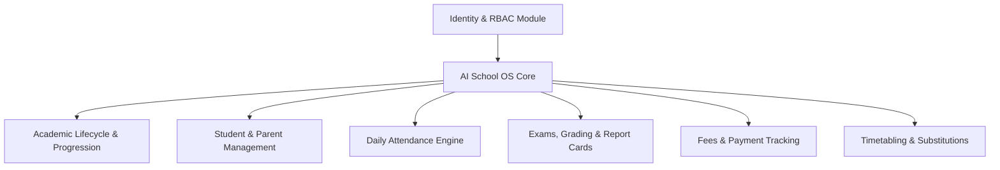

# AI School OS — Project Vision & System Overview

## 1. Executive Vision

**AI School OS** is a modern, enterprise-grade, multi-tenant School Management System (ERP) engineered for educational institutions. The platform provides complete digital management of the academic lifecycle—from student admissions and parent/guardian relationships to dynamic timetabling, exam evaluation, fee structure assignments, and automated end-of-year academic progression rollover.

Designed with strict tenant isolation, role-based access control (RBAC), immutable audit histories, and soft-deletion policies, AI School OS delivers complete operational transparency while safeguarding student records.

---

## 2. Core Architectural Principles

- **Strict Multi-Tenancy**: Every school operates as an isolated tenant (`school_id`). Queries and business operations enforce tenant scoping at the API and repository layers.
- **Layered Architecture**: Strict separation of concerns following **API Endpoints → Domain Services → Repositories → SQLAlchemy Models**.
- **Immutable Historical Records**: Student class and enrollment placements are preserved across academic years in historical ledgers (`StudentEnrollmentHistory`).
- **Deterministic Academic Progression**: Prospective progression planning and automated rollover execution validate prospective rule matrices (`ClassProgressionRule`) and enforce execution plan hashes (`SHA-256`) and header-based idempotency.
- **Soft Deletion & Auditability**: System entities inherit standard audit fields (`id`, `created_at`, `updated_at`, `is_deleted`, `deleted_at`, `deleted_by_user_id`). Physical `DELETE` queries are prohibited for standard business entities.

---

## 3. Major System Modules

### Module Breakdown

1. **Identity & Security**:
   - Authentication via JWT access and refresh tokens.
   - Fine-grained permission enforcement (`require_permission`) and dynamic role-permission mappings.
   - Rejection of soft-deleted/inactive user accounts (`get_current_user`).

2. **Academic Infrastructure & Progression Engine**:
   - **Academic Years & Terms**: Single active current year invariant per school.
   - **Progression Matrix**: Configurable `ClassProgressionRule` mappings (Source Class → Target Class or Terminal).
   - **Progression Planner**: Prospective read-only calculation of promotion/retention/graduation outcomes.
   - **Progression Preview**: API endpoint providing full execution dry-run and summary metrics.
   - **Progression Execution**: Atomic, transactional rollover engine with execution plan hash verification (`SHA-256`) and idempotency key enforcement.

3. **Student & Parent Management**:
   - Unique permanent admission numbers (`ADM-XXXXXX`) and annual sequence roll number generation.
   - Comprehensive student profiles, enrollment history ledgers, and Transfer Certificate (TC) workflows.

4. **Attendance Management**:
   - Daily section-level student attendance tracking with status types (`PRESENT`, `ABSENT`, `LATE`, `EXCUSED`).
   - Partial unique indexing preventing double-recording per student/date.

5. **Exams, Evaluation & Report Cards**:
   - Assessment types, exam schedules, mark entry, grade scale evaluation, and report card generation.

6. **Fees & Payment Collection**:
   - Fee structures, itemized discounts, student fee assignments, and transaction payment logging.

7. **Timetabling & Teacher Substitutions**:
   - Period slots, classroom allocation, schedule conflict validation, and draft/published timetable state immutability.
