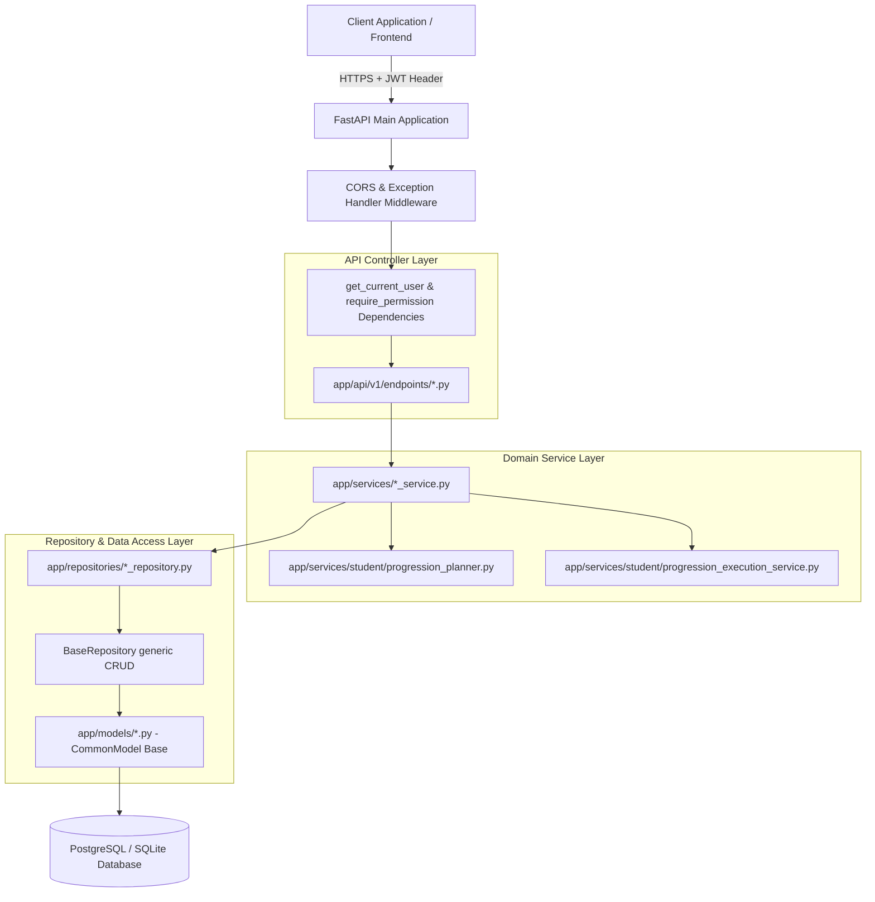
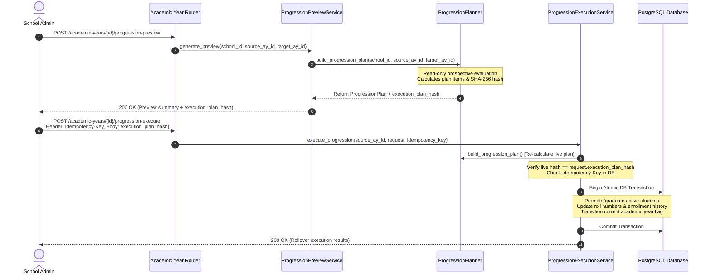

# AI School OS — System Architecture Document

## 1. High-Level System Architecture

**AI School OS Backend** is built using Python 3.14, FastAPI, SQLAlchemy 2.0 ORM, and PostgreSQL. The system adheres to strict layered domain design patterns, multi-tenant isolation, and declarative security dependencies.



---

## 2. Layering Architecture

### 2.1 API Endpoint Layer (`app/api/v1/endpoints/`)
- Handles HTTP route matching, Pydantic schema validation, header parsing, dependency injection, and uniform JSON response formatting via `ApiResponse.success()`.
- Controllers contain **no database query logic** or raw SQL statements.

### 2.2 Domain Service Layer (`app/services/`)
- Encapsulates business rules, state transitions, validation checks, and multi-step transaction orchestration.
- Services inherit from `BaseService[T]` and receive repository instances via dependency injection (`app/dependencies/services.py`).

### 2.3 Repository Layer (`app/repositories/`)
- Encapsulates database querying, filtering, pagination, and session state operations using SQLAlchemy ORM statements.
- Inherits from `BaseRepository[ModelType]` providing standard `get`, `get_all`, `create`, `update`, `soft_delete`, and count methods.

### 2.4 Data Model Layer (`app/models/`)
- SQLAlchemy ORM model definitions inheriting from `CommonModel` (`app/database/common_model.py`).
- Declares table structures, foreign key constraints (`CASCADE` or `RESTRICT`), indices, relationships, and partial unique indices.

---

## 3. Identity, Security & RBAC Architecture

### 3.1 JWT Token Verification Flow
1. Incoming requests present `Authorization: Bearer <access_token>` header.
2. `get_current_user` extracts `sub` (User ID) and `school_id` from payload.
3. Rejects token if `type != ACCESS`.
4. Queries `IdentityUser` from database and asserts `user.is_active is True` and `user.is_deleted is False`.

### 3.2 Permission Enforcement
- API endpoints decorate dependencies with `Depends(require_permission("permission_name"))`.
- `require_permission` dynamically inspects `user.roles -> role.permissions` and raises `ForbiddenException` if the required permission string is missing.

---

## 4. Multi-Tenant Isolation Strategy

- Multi-tenancy is enforced at the database level by including `school_id` as an indexed column on all tenant-specific tables.
- Services accept `current_school_id = current_user.school_id` from the authenticated session context.
- All repository queries filter explicitly by `Model.school_id == school_id`.
- Entity lookups (e.g. `_get_valid_class`, `_get_valid_section`) verify that parent and referenced entities belong to `current_user.school_id` to prevent cross-tenant IDOR attacks.

---

## 5. Soft-Deletion Policy & Partial Indexing

- **CommonModel Fields**:
  - `is_deleted`: `Boolean` (default `False`)
  - `deleted_at`: `DateTime(timezone=True)` (nullable)
  - `deleted_by_user_id`: `UUID` (nullable)
- **Soft Delete Behavior**: Calling `repository.soft_delete(db, entity_id)` sets `is_deleted = True` and populates deletion timestamps.
- **Partial Unique Indexes**: Unique constraints across models (e.g. class names, section names, roll numbers, admission numbers) use partial indexing:
  ```sql
  CREATE UNIQUE INDEX uq_school_classes_school_name_active
  ON school_classes (school_id, name)
  WHERE is_deleted = FALSE;
  ```
  This guarantees uniqueness among active records while enabling re-creation of entity names following soft-deletion.

---

## 6. Academic Progression Rollover Architecture (Phase 4B)



### Key Architectural Guarantees
- **Strict Read-Only Planner**: `ProgressionPlanner` is pure and read-only. It performs prospective calculations without mutating database state.
- **Plan Hash Verification**: `execution_plan_hash` (SHA-256) guarantees that the executed plan matches the previewed calculation byte-for-byte.
- **Idempotency Locking**: Execution requests record `idempotency_key` in `progression_executions`. Replay requests return the saved execution result without re-executing data changes.
- **Atomic Rollover Transaction**: Enrollment history updates, student status changes, roll number sequence assignments, and academic year status updates execute within a single atomic database transaction.
