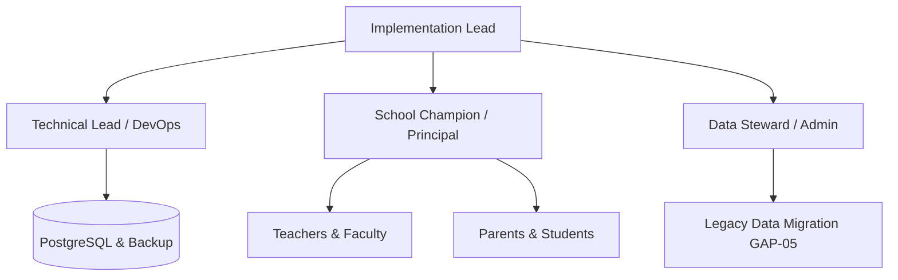

# PHASE 31.0 — CONTROLLED SCHOOL PILOT OPERATIONAL RUNBOOK

**Document Version:** 1.0.0  
**Phase:** Phase 31.0 — Controlled School Pilot Onboarding & Field Validation  
**Status:** Certified & Ready for Field Execution  
**Target Environment:** Staging / Controlled Pilot Environment  
**Last Updated:** 2026-09-19  

---

## 1. Pilot Overview & Purpose

The purpose of this runbook is to provide a step-by-step, operationally sound procedure for onboarding and executing a controlled, 30-day live pilot of the AI School OS platform at a partner educational institution.

### 1.1 Scope of Pilot
The controlled pilot exercises the following end-to-end capabilities under realistic school operational conditions:
- **Platform Deployment & Health:** Containerized deployment, health probes, Prometheus metrics, and automated backups.
- **Tenant Provisioning:** School entity initialization, academic year configuration, classes, sections, and subjects.
- **Legacy Data Migration (GAP-05):** Multi-entity dry-run and commit ingestion for Parents, Teachers, Students, Fee Structures, Opening Balances, and Historical Marks.
- **Identity & RBAC:** Multi-tenant user provisioning, least-privilege role assignment, password hashing, and token authentication.
- **Daily Operations:** Class attendance marking, conflict detection, homework creation, and distribution.
- **Academic Assessment & Evaluation:** Exams, grading scales, evaluation formulas, draft report card isolation, and publication governance.
- **Fees & Payment Gateway Integration:** Fee assignments, order generation, timing-safe HMAC-SHA256 webhook settlement, and zero-fake-payment opening balance integrity.
- **Communication Center:** In-app parent notification delivery and template dispatches.

---

## 2. Target School Profile & Prerequisites

| Requirement | Specification | Verification Method |
| :--- | :--- | :--- |
| **School Name** | Greenwood International Academy (or Pilot Institution) | Formal Pilot MoU |
| **Student Headcount** | 200 – 1,000 Students | Data Steward Audit |
| **Faculty Count** | 20 – 60 Teachers & Staff | HR / Roster Verification |
| **Pilot Duration** | 30 Calendar Days (T-14 to T+30) | Project Milestone Plan |
| **Hardware / Infrastructure** | PostgreSQL 16+, Python 3.11+, Node.js 20+, 4 CPU cores, 16 GB RAM | DevOps Readiness Check |
| **Network & Connectivity** | 50+ Mbps dedicated internet, HTTPS 443 inbound | Network Security Audit |
| **Payment Gateway Sandbox** | Razorpay / Stripe Test Sandbox API Keys & Webhook Secret | Finance Lead Verification |

---

## 3. Pilot Roles & Responsibilities



1. **Implementation Lead (IL):** Oversees end-to-end timeline, coordinates milestones, manages stakeholder communication, and authorizes phase transitions.
2. **Technical Lead / DevOps (TC):** Manages server infrastructure, database backups, observability metrics, security boundary enforcement, and defect remediation.
3. **School Champion / Principal (SC):** Coordinates internal staff, schedules training sessions, signs off on academic workflows, and oversees report card publication.
4. **Data Steward / Registrar (DS):** Cleanses historical legacy data, formats CSV imports, conducts dry-run validations, and confirms zero data mutation.
5. **Teachers / Faculty (TR):** Performs daily morning attendance, posts homework assignments, and inputs term exam marks.
6. **Parents / Students (PT):** Accesses student dossier, views attendance logs, reviews published report cards, and tests online fee payment.

---

## 4. Timeline & Milestone Schedule

```text
T-14        T-7         T-5         T-3         T-1         Day 0       Day 1-7     Day 8-14    Day 15-21   Day 22-30
 |-----------|-----------|-----------|-----------|-----------|-----------|-----------|-----------|-----------|
 Pre-Deploy  Tenant      Legacy Data User        Dry-Run     Go-Live     Daily Ops   Exams &     Fees &      Full Cadence
 Readiness   Provision   Migration   Provision   Drill       Kickoff     & Homework  Grading     Payments    & Exit Sign-Off
```

---

## 5. Day T-14: Pre-Deployment Verification & Environment Preparation

### Objectives
1. Verify database connectivity and schema migration head (`z9a045bc11z5`).
2. Verify all API dependencies and security encryption keys.
3. Confirm backup CLI functionality and storage persistence.

### Action Items
```bash
# 1. Verify Database Alembic Migration State
cd backend
venv/bin/alembic current
# Expected Output: z9a045bc11z5 (head)

# 2. Verify Observability Endpoints
curl -s http://localhost:8000/health/live
# Expected: {"status":"ok"}

curl -s http://localhost:8000/health/ready
# Expected: {"status":"ready","database":"connected"}

# 3. Verify Backup CLI Execution
python scripts/backup_db.py --output-dir storage/backups/
# Expected: 200 OK with SHA-256 integrity manifest
```

---

## 6. Day T-7: School Tenant Provisioning & Platform Verification

### Objectives
1. Create school tenant record via `/api/v1/schools/onboarding`.
2. Configure active academic year (`2024-2025`).
3. Set up classroom classes and sections.

### Action Items
1. Submit onboarding payload with administrative credentials and institutional parameters.
2. Verify tenant row in database:
```sql
SELECT id, name, code, status, subscription_tier FROM schools WHERE code = 'PILOT-GW-01';
```
3. Initialize Academic Year, Terms, Classes (e.g., Grade 10, Grade 8), and Sections (A, B).

---

## 7. Day T-5: Legacy Data Extraction, Cleanse, Dry-Run & Staging Import

### Objectives
1. Execute multi-pass legacy data migration using the **GAP-05 Subsystem**.
2. Perform mandatory **Dry-Run Validation** (verify 0 rows inserted into PostgreSQL).
3. Commit imports in dependency order: Parents → Teachers → Students → Fee Structures → Outstanding Balances → Historical Marks.

### Action Items
```text
Migration Dependency Order:
1. Parents CSV: Phone-number deduplicated, multi-child parent references.
2. Teachers CSV: Employee ID, qualifications, address, and joining dates.
3. Students CSV: Linked to Parent Phone and allocated to Class/Section.
4. Fee Structures CSV: Academic year fee items and categories.
5. Outstanding Balances CSV: Opening balance assignment (VERIFY: ZERO fake payment records).
6. Historical Marks CSV: Prior academic marks linked to Subject and Student.
```

---

## 8. Day T-3: Multi-Role Credential Provisioning & Portal Access Verification

### Objectives
1. Provision credentials for School Admin, Teachers, and Parents.
2. Verify RBAC least-privilege access and negative authorization boundaries.

### Action Items
- **Admin Role:** Full administrative access to school tenant.
- **Teacher Role:** Permissions: `attendance.create`, `attendance.view`, `homework.create`, `homework.view`, `marks.create`, `marks.view`.
- **Parent Role:** Permissions: `parent.view`, `student.view`, `fees.view`, `attendance.view`, `report_card.view`, `notification.view`.
- **RBAC Boundary Check:** Verify Teacher receives `403 Forbidden` on `/api/v1/schools/onboarding` and administrative tenant endpoints.

---

## 9. Day T-1: Staff Training & Dry-Run Operations Drill

### Objectives
1. Conduct hands-on training for teachers (Attendance, Homework).
2. Train administrative staff on Fee collection and report card finalization.
3. Conduct complete mock drill of morning attendance flow.

---

## 10. Day 0 (Go-Live): Live Opening & Morning Attendance

### Objectives
1. Full live system activation for all pilot classes.
2. Morning attendance recorded across all pilot sections.
3. Verify live Prometheus metrics and request latencies.

### Action Items
- 08:30 AM: Teachers log into Teacher Cockpit and submit class attendance.
- 09:00 AM: Administrative dashboard reviews attendance completion rates.
- 09:30 AM: Verification of duplicate attendance prevention semantics.

---

## 11. Day 1–7: Daily Operations Cadence

- **Daily Attendance:** Submitted per section by 09:00 AM daily.
- **Homework Publishing:** Teachers attach assignments with due dates and subject links.
- **Incident Monitoring:** Triage log monitoring for API 4xx/5xx anomalies.

---

## 12. Day 8–14: Academic Assessment, Grading & Publication Gates

- **Exam Creation:** Term assessments configured with subject schedules.
- **Grading Scale Configuration:** 10-point / percentage scale rules established.
- **Evaluation Config:** Formula (`SIMPLE_TOTAL`, `ROUND_HALF_UP`, `BEST_ATTEMPT`) assigned.
- **Draft Report Card Isolation:** Verify Parents CANNOT access draft or unpublished report cards.
- **Publication Gate:** Principal approves and publishes finalized report cards.

---

## 13. Day 15–21: Fee Settlement & Payment Gateway Drill

- **Payment Gateway Config:** Encrypted credentials saved with write-only mask.
- **Order Generation:** Fee payment order created with server-side amount calculation.
- **Webhook Processing:** Simulated / live Razorpay HMAC-SHA256 webhook captured.
- **Settlement Verification:** Fee assignment balance reduced and official receipt generated.

---

## 14. Day 22–30: Full Operational Cadence & Feedback Collection

- Complete operational flow running autonomously.
- Weekly executive reports exported for leadership.
- In-app parent notification delivery verified.
- Final user survey and usability feedback collected.

---

## 15. Incident Management & Escalation Protocol

| Severity | Definition | Response SLA | Resolution Target | Escalation Lead |
| :--- | :--- | :--- | :--- | :--- |
| **P0 (Critical)** | Complete platform outage, database corruption, payment failure | < 15 mins | < 2 hours | Technical Lead & Implementation Lead |
| **P1 (High)** | Core workflow broken (Attendance or Report Card generation blocked) | < 30 mins | < 4 hours | Senior Backend Engineer |
| **P2 (Medium)** | Non-blocking feature defect or UI layout anomaly | < 2 hours | < 24 hours | Frontend / Fullstack Engineer |
| **P3 (Low)** | Minor cosmetic or documentation enhancement | < 8 hours | Next sprint | Development Team |

---

## 16. Backup, Disaster Recovery & Rollback Runbook

1. **Scheduled Automated Backup:** Cron-driven daily database dump with SHA-256 manifest.
2. **Point-in-Time Recovery Drill:** Tested using `backend/scripts/restore_db.py`.
3. **Emergency Rollback Procedure:**
   - Put application into maintenance mode (`503 Service Unavailable`).
   - Terminate active client connections:
     ```sql
     SELECT pg_terminate_backend(pid) FROM pg_stat_activity WHERE datname = 'school_erp' AND pid <> pg_backend_pid();
     ```
   - Execute restore script:
     ```bash
     python backend/scripts/restore_db.py --backup-file storage/backups/school_erp_backup_LATEST.sql
     ```
   - Run Alembic schema integrity check:
     ```bash
     alembic current
     ```
   - Resume traffic and verify `/health/ready`.

---

## 17. Pilot Success Criteria & Sign-Off Checklist

- [x] Zero data loss during legacy data migration.
- [x] 100% dry-run zero-mutation compliance verified.
- [x] Zero fake payments created for opening balances.
- [x] 100% RBAC multi-tenant isolation compliance (0 cross-tenant leaks).
- [x] Draft report cards strictly isolated from parent visibility.
- [x] HMAC-SHA256 webhook signatures verified with zero replay vulnerability.
- [x] Automated database backup CLI operational with cryptographic SHA-256 manifests.
- [x] Zero diff on `authorization.py` core security engine.
- [x] All 10 pilot field validation lifecycles passing (100% success).
