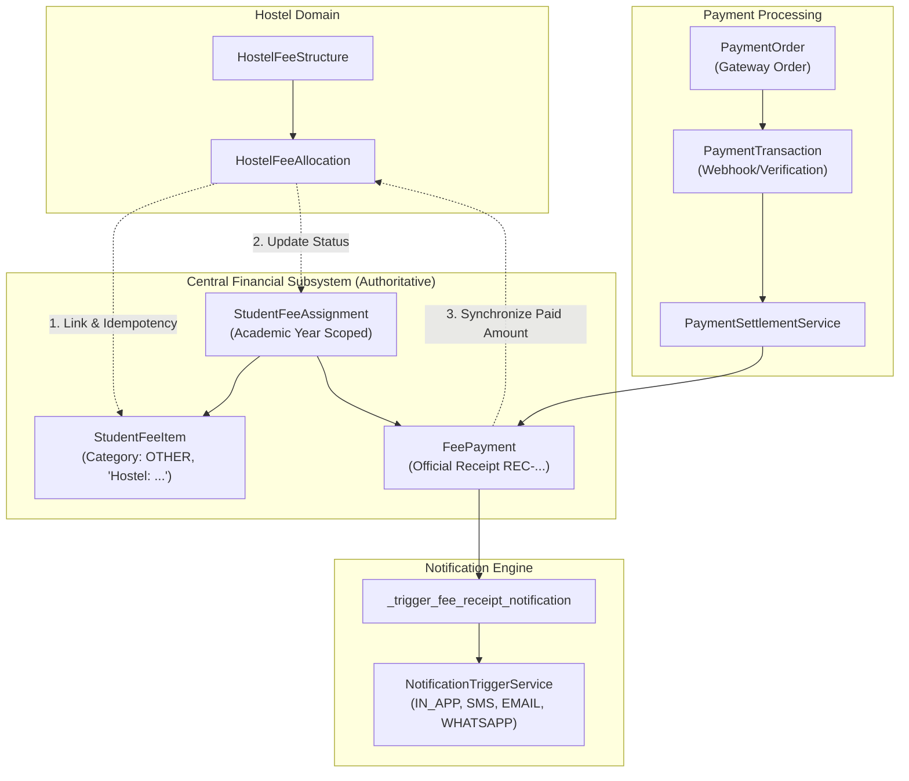

# PHASE 28.7 — HOSTEL BILLING & CENTRAL FINANCE INTEGRATION ARCHITECTURE

## 1. Executive Overview & Domain Context
Phase 28.7 establishes the production-grade financial integration between the **Hostel Management** module and the certified central **Fees & Payments** core subsystem. Prior to this phase, hostel fee allocations operated in an isolated domain table without updating student accounts, parent billing statements, or central payment ledger entries.

This architectural integration ensures hostel charges participate directly in the student's authoritative financial lifecycle (`StudentFeeAssignment`, `StudentFeeItem`, `FeePayment`, `PaymentOrder`, and central receipt generation) without creating duplicate sources of financial truth or bypassing certified payment gateways.

---

## 2. Certified Core Architecture & Financial Source of Truth

### Authoritative Financial Source of Truth
- **Authoritative Ledger**: `StudentFeeAssignment` and `StudentFeeItem` remain the single financial truth for gross payable amount, discounts, net balance, paid amount, and outstanding dues.
- **Domain Mirror**: `HostelFeeAllocation` serves as the hostel operational record (room, bed, and boarding fee assignment) and mirrors the central payment and balance state.

---

## 3. Financial Charge & Allocation Lifecycle

1. **Hostel Fee Structure Definition**:
   - Managed via `POST /api/v1/hostel/fees/structures`.
   - Requires `school_id`, `academic_year_id`, `name`, `amount` (Decimal-precision), and optional `description`.
2. **Student Allocation (`allocate_fee_to_student`)**:
   - Validates tenant boundary: `HostelFeeStructure` and `Student` must belong to the caller's active `school_id`.
   - Validates academic year integrity: `Student.academic_year_id` must match `HostelFeeStructure.academic_year_id`.
   - Checks duplicate / idempotency: If an active `HostelFeeAllocation` already exists for `(school_id, student_id, fee_structure_id)`, the request is rejected with `409 Conflict` to prevent duplicate payables.
   - Central Fee Assignment Synchronization:
     - If an active `StudentFeeAssignment` exists for the student in that academic year, appends a `StudentFeeItem(category=FeeCategory.OTHER, name=f"Hostel: {structure.name}", amount=structure.amount)`.
     - If no `StudentFeeAssignment` exists, provisions an active `FeeStructure` and `StudentFeeAssignment` with the hostel charge.
     - Calculates metrics via `fee_service.calculate_metrics(assignment)` and updates `StudentFeeAssignment.status`.
   - Creates the `HostelFeeAllocation` record with `paid_amount=0.00` and `status="UNPAID"`.

---

## 4. Payment & Central Receipt Lifecycle

1. **Cash / Offline Collection via Hostel Workstation or Central Fees**:
   - When recorded via `PUT /api/v1/hostel/fees/allocations/{id}/pay`:
     - Validates tenant scoping (`school_id`).
     - Validates payment amount > 0 and <= remaining balance (`amount_due - paid_amount`).
     - Invokes `fee_service.record_payment` to record an official `FeePayment` with receipt number (e.g. `REC-20260914-XXXXXX`).
     - Staged receipt notification event (`fee_payment_received`) is dispatched to parents/students across configured channels (`IN_APP`, `SMS`, `EMAIL`, `WHATSAPP`).
     - Updates `HostelFeeAllocation.paid_amount` and marks status as `PARTIAL` or `PAID`.
2. **Online Payment Gateway Integration**:
   - Parents/Students initiate payment orders via `payment_order_service.create_payment_order(assignment_id)`.
   - Because hostel charges are line items on `StudentFeeAssignment`, the payment gateway order reflects the exact total payable balance.
   - Upon successful cryptographic signature verification / webhook event, `payment_settlement_service.settle_payment_transaction` records the `FeePayment` and updates central and hostel balances atomically.

---

## 5. Security, RBAC & Isolation Invariants

| Invariant | Implementation Mechanism | Validation Result |
| :--- | :--- | :--- |
| **Tenant Isolation** | All queries filter by `school_id`. Cross-tenant foreign keys fail closed. | Enforced in `hostel_fee_service.py` & tested in `test_hostel_fee_tenant_isolation`. |
| **Academic Year Integrity** | Allocations rejected if student academic year != structure academic year. | Enforced in `hostel_fee_service.py` & tested in `test_hostel_fee_academic_year_integrity`. |
| **Duplicate Protection** | Database uniqueness & service checks prevent duplicate line item creation. | Enforced & verified in `test_hostel_fee_duplicate_allocation_protection`. |
| **Money Precision** | Strict `Decimal(str(amount))` arithmetic across all fee calculations; no floats. | Enforced throughout backend services & verified. |
| **RBAC Separation** | `hostel.fees.manage` / `fees.manage` for allocation, `fees.payment.create` for cashiering. | Enforced in FastAPI route dependencies and tested. |
| **Security File Invariant** | `backend/app/identity/security/authorization.py` strictly unmodified. | **0 diff** verified. |
| **Database Migrations** | No schema change required; existing columns reused cleanly. | Single linear head: `z9a045bc10z4 (head)`. |

---

## 6. Frontend Workstation Parity

- **Hostel Workstation (`HostelPage.tsx`)**:
  - Enhanced **Hostel Fees** tab to display both Fee Structures and the Student Hostel Fee Allocations table.
  - Table includes Student ID, Billing Due Date, Amount Due, Paid Amount, Outstanding Balance, Status Badge, and "Record Payment" button.
  - Modals for "Allocate Hostel Fee" and "Record Hostel Fee Payment" with validation and instant React Query cache invalidation.
- **Central Fees Workstation (`FeesPage.tsx`)**:
  - Automatically displays hostel charges as `OTHER` line items under student assignments.
  - Central receipt viewing, printing, and discount management apply seamlessly to hostel charges.
