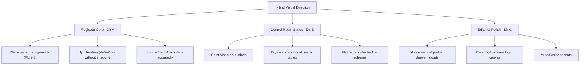

# Phase 6.1 — Stitch Design Exploration & Analysis

This document analyzes the design directions generated and explored through the Stitch MCP project contexts (`projects/8299765694973296786` and `projects/257648159526339468`) and establishes our evolved visual design direction.

---

## Part 1: Analysis of the 3 Stitch Directions

We generated and critiqued three distinct design layouts using the Stitch system for the core Command Center, Registry, and Progression modules:

### Direction A: "Institutional Registrar"
* **Characteristics**: Archival, scholarly, highly dense, paper/document-driven structure, thin rules, and registry-like tables.
* **Stitch Findings**:
  - Background is set to a warm, flat `#fcf9f8` paper/parchment tone.
  - Removes all container shadows and cards, replacing them with sharp, 1px `#e5e2da` board dividers.
  - Uses `Source Serif 4` for titles to suggest traditional scholarship, paired with a neat sans-serif for data.
  - High density table displays (`py-2` and `px-3` cells) optimize text-heavy registrar list pages.
* **Verdict**: Highly credible and structured; matches the administrative persona of a school registrar.

### Direction B: "Academic Operations Control Room"
* **Characteristics**: Operational, structured, status-oriented, timeline/ledger grids, and dark accents.
* **Stitch Findings**:
  - Highlights status indicators with clear colored badge structures (rather than pill buttons).
  - Employs monospaced typography (`Geist Mono`) for ID labels, plan hashes, timestamps, and log registries.
  - Visualizes complex workflows like Academic Progression with multi-step ledgers (matrix grids and dry-run promotion verification panels).
* **Verdict**: Essential for administrative actions, progress tracking, and secure system rollover calculations.

### Direction C: "Modern Institutional Editorial"
* **Characteristics**: Contemporary, editorial hierarchy, asymmetrical alignments, intentional whitespace, and restrained components.
* **Stitch Findings**:
  - Utilizes asymmetrical column sizing to group detailed record drawers (such as the Student Dossier profile drawer).
  - Enhances empty and loading states with simple typography and descriptive, non-intrusive placeholders.
  - Focuses on crisp, high-end editorial login pages, replacing generic input fields with bottom-border-only input fields and strict alignment.
* **Verdict**: Adds premium aesthetic polish and prevents the app from feeling like a retro spreadsheet tool.

---

## Part 2: Selected Design Direction

To achieve the ultimate product vision of **"AI School OS — The Academic Operating System"**, we will employ a **Hybrid Design Direction** combining the strengths of the three Stitch explorations:

### Why the Hybrid Direction Wins
1. **Institutional Credibility**: Scholarly serif headlines feel established and prestigious, like an official university or preparatory institution document.
2. **Operational Density**: Sharp, flat tables and tight vertical grids present massive amounts of administrative information at a glance.
3. **Distinctiveness**: Steers completely clear of the bubble-gum purple gradient templates common in modern AI SaaS startups, utilizing instead a refined color palette of warm parchment, deep carbon ink, and restrained institutional blue.
4. **Accessible Authority**: Desaturated alerts and status badges ensure high contrast (meeting WCAG accessibility requirements) without introducing visual noise.
